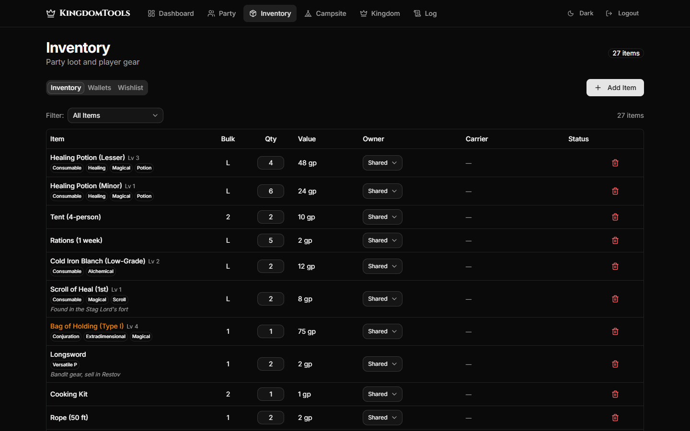
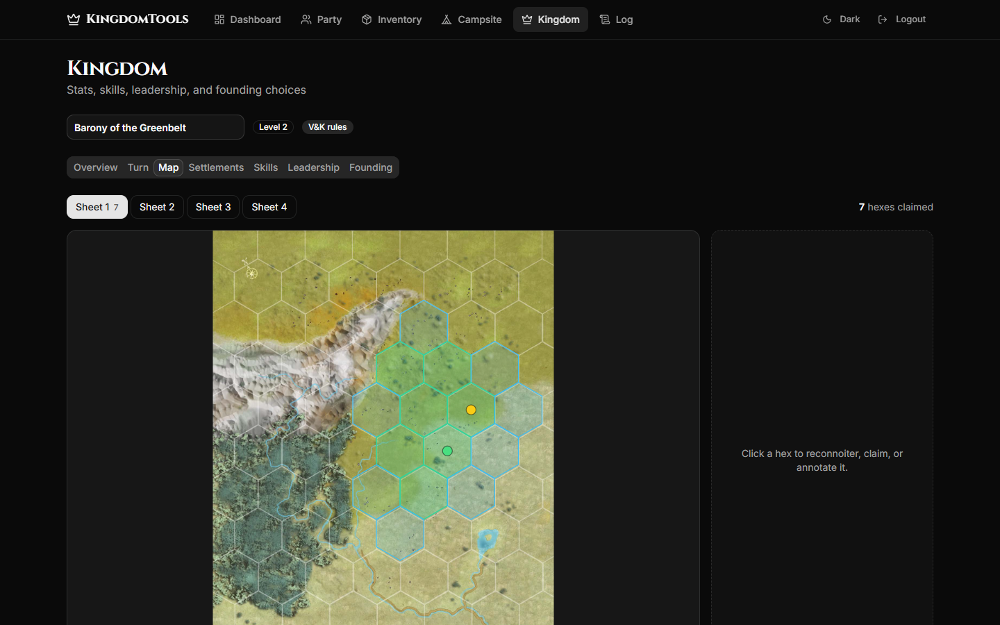
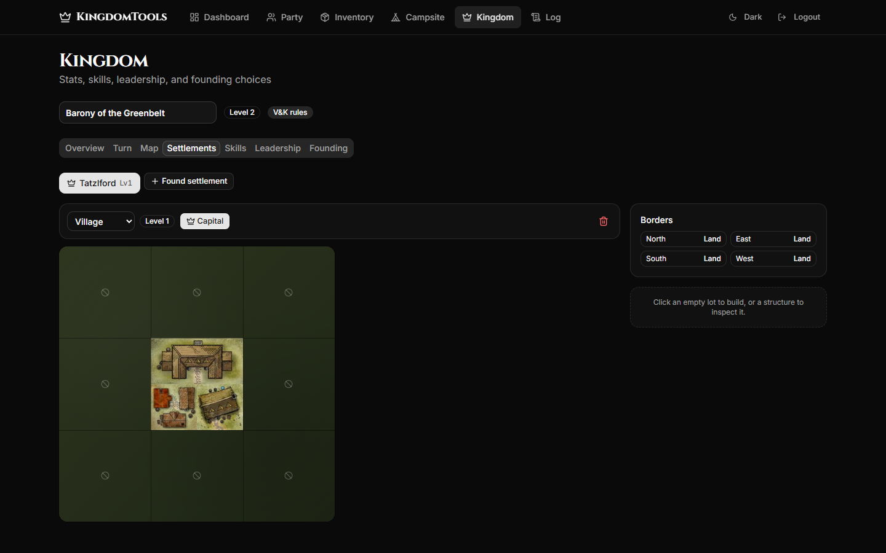
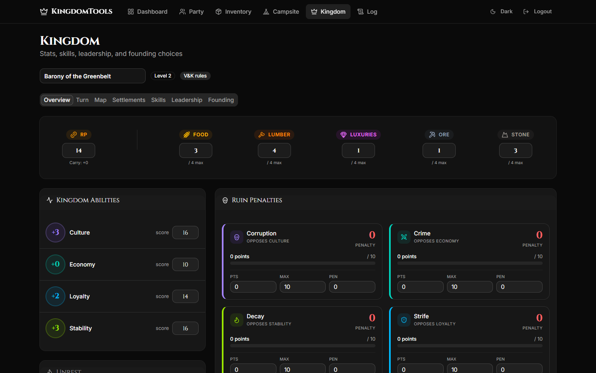
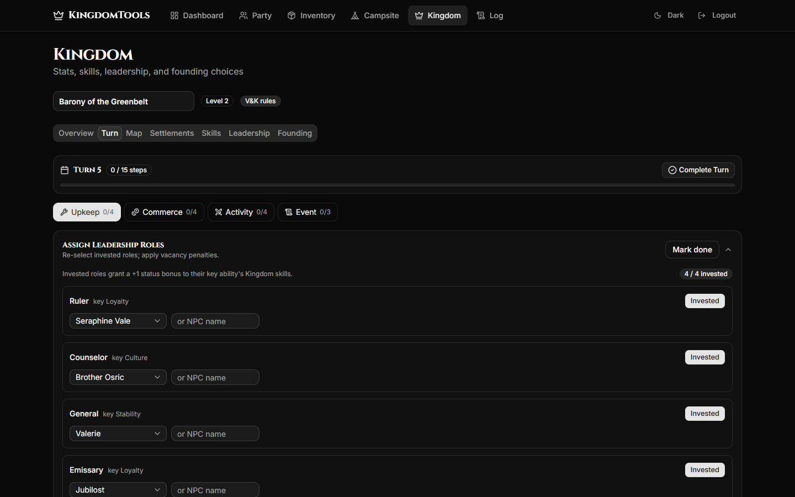
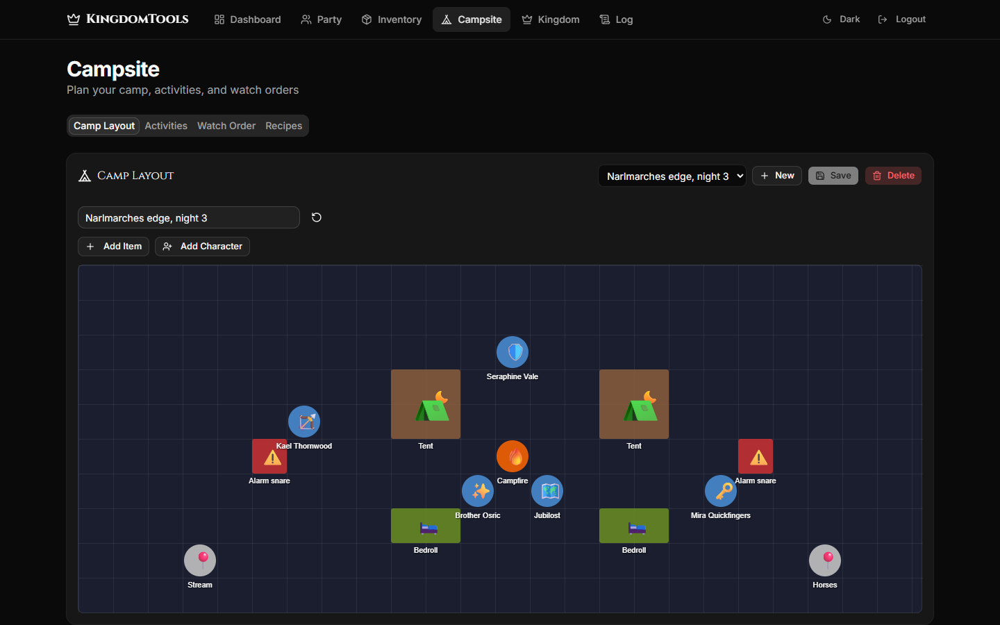
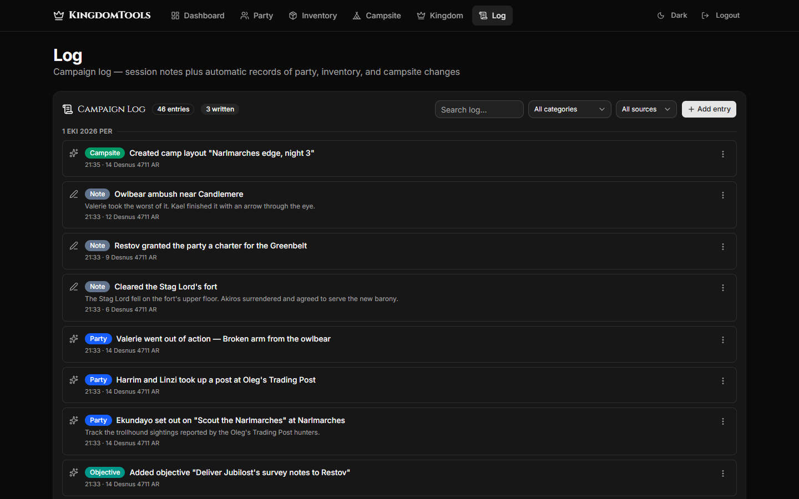
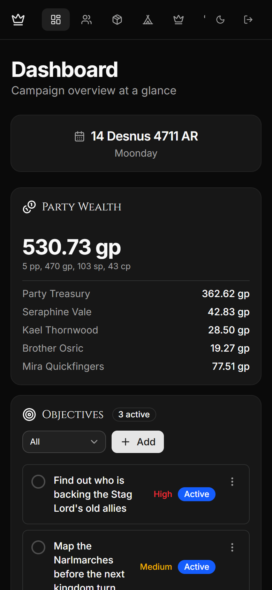

# KingmakerTools

A companion web app for groups playing the Pathfinder Second Edition *Kingmaker*
Adventure Path. It keeps track of the campaign logistics between sessions, so
your virtual tabletop (Foundry, Roll20 or plain paper) can stay focused on the
encounters.

It is built for players first. One person hosts it, and the whole party shares
it from their browser, on desktop or phone.


## What it does

- **Party:** characters and NPC companions, including who is away on a quest,
  stationed somewhere, injured or missing.
- **Inventory:** shared party loot by default, with items assigned to characters
  when needed. Bulk, encumbrance, coins and invested items follow the PF2e rules.
- **Campsite:** a drag-and-drop camp layout.
- **Kingdom:** the full kingdom building system, with a founding wizard, a hex map,
  settlement grids, structures and a step-by-step kingdom turn tracker. Supports
  both the official rules and the Vance & Kerenshara rule changes.
- **Log and calendar:** a campaign log and a Golarion calendar that the rest of
  the app keeps in sync with.

## Running it

You need [Docker Desktop](https://www.docker.com/products/docker-desktop/)
(Windows or Mac) or Docker Engine (Linux).

1. Download `docker-compose.yml` from the
   [latest release](https://github.com/prof958/KingmakerTools/releases/latest)
   and put it in an empty folder.
2. Open it and change `APP_PASSWORD`. Everyone in your party logs in with this
   password.
3. In that folder, run:

   ```bash
   docker compose up -d
   ```

4. Open <http://localhost:3000>.

Party members on the same network can connect at `http://<host's IP>:3000`.
For friends elsewhere, run it on a small server (VPS) or share it with a tool
like Tailscale. If you put it behind HTTPS, set `SECURE_COOKIES: "true"` in the
compose file.

Your data is kept in Docker volumes, so it survives restarts and updates.

| Task | Command |
|---|---|
| Update to the latest version | `docker compose pull && docker compose up -d` |
| Stop | `docker compose down` |
| Back up the database | `docker compose exec db pg_dump -U kingmakertools kingmakertools > backup.sql` |

## Development

Requires Node.js 22 and Docker (for the local database).

```bash
cp .env.example .env
npm install
npm run dev:setup   # starts a local Postgres container and applies migrations
npm run dev
```

Open <http://localhost:3000> and log in with `kingmaker`.

| Command | What it does |
|---|---|
| `npm test` | Run the tests |
| `npm run db:studio` | Browse the local database |
| `npm run db:seed` | Load the starter item catalog |
| `npm run db:reset` | Wipe the local database and start over |
| `npm run db:down` | Stop the local database, keeping its data |

The local database runs from `docker-compose.dev.yml` on its own Docker volume,
bound to localhost only. It is separate from any deployed instance.

Built with Next.js, React, Prisma, PostgreSQL and Tailwind CSS.

### Releasing

Bump `version` in `package.json`, then push a tag:

```bash
git tag v0.2.0 && git push origin v0.2.0
```

GitHub Actions runs the tests, publishes the `ghcr.io/prof958/kingmakertools`
image and creates a release with `docker-compose.yml` attached.

## Rulebook data

Kingdom activities, structures and map art are extracted from the *Kingmaker
Player's Guide* (a free download from Paizo) and the fan-made *Vance &
Kerenshara's 2e Kingdom Building Rule Changes*. The PDFs are not included here.
To regenerate the data, place them in `docs/` as `Kingmaker+Players+Guide.pdf`
and `Vance and Kerenshara's 2e Kingdom Building Rule Changes.pdf`, then run the
matching `scripts/extract-kingdom-*.py` script (requires `pymupdf`).

KingmakerTools is an unofficial fan project and is not affiliated with or
endorsed by Paizo Inc.

## More screenshots

<table>
  <tr>
    <td width="50%"><br><b>Inventory.</b> Shared loot with bulk, value and owner.</td>
    <td width="50%"><br><b>Kingdom map.</b> Reconnoiter and claim hexes on the Stolen Lands map.</td>
  </tr>
  <tr>
    <td><br><b>Settlements.</b> Build structures on the urban grid.</td>
    <td><br><b>Kingdom overview.</b> Resources, abilities and ruin.</td>
  </tr>
  <tr>
    <td><br><b>Kingdom turn.</b> Every step of the turn, in order.</td>
    <td><br><b>Campsite.</b> Lay out the camp and plan the watch.</td>
  </tr>
  <tr>
    <td><br><b>Log.</b> Session notes plus an automatic record of changes.</td>
    <td align="center"><br><b>On a phone.</b> The dashboard on mobile.</td>
  </tr>
</table>
